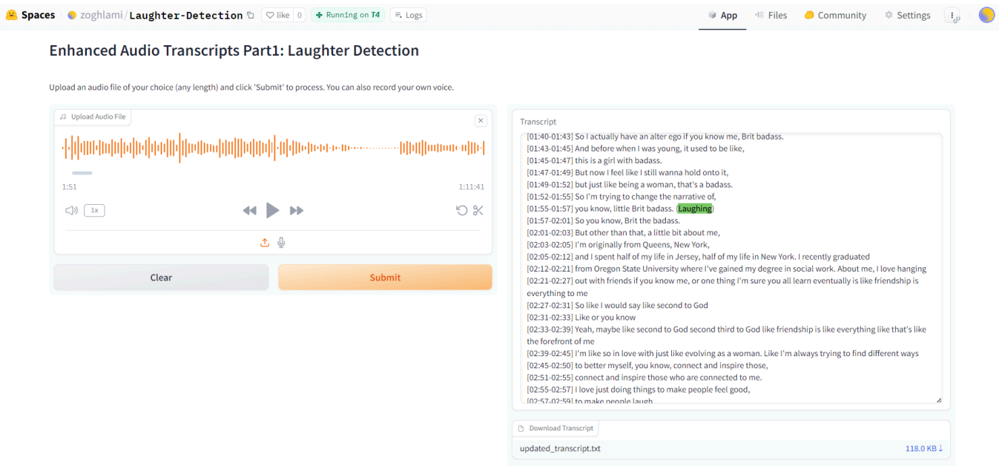
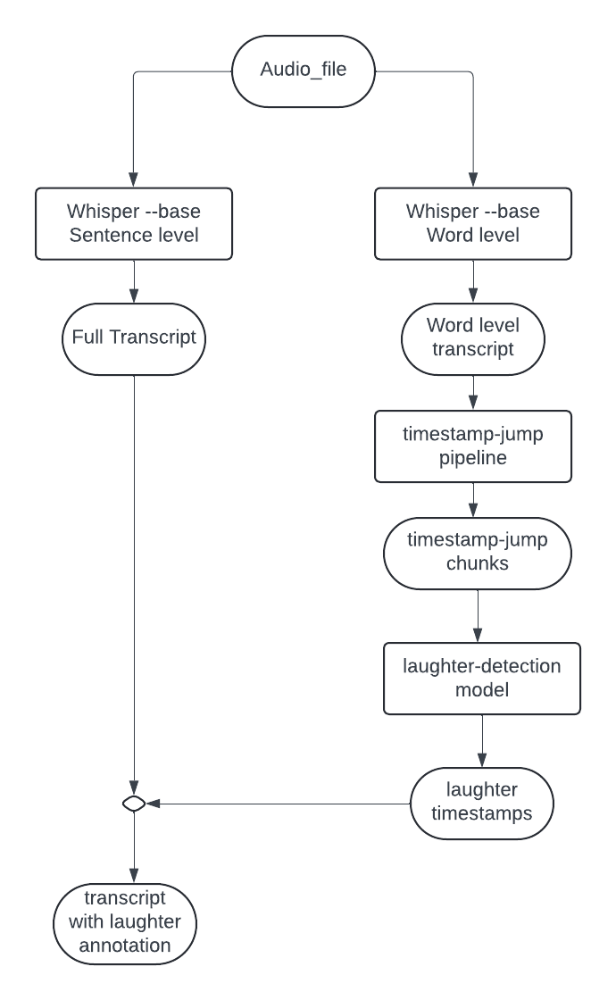

# User Guide - Laughter Detection

## Introduction

“Enhanced Audio Transcripts Part1: Laughter Detection” is the first part of the research project I’m currently working on. This tool is designed to enrich audio transcriptions by accurately identifying and marking instances of laughter within the audio file. This is done by incorporating the notation "(Laughing)" whenever a laughter is detected.

## Usage

To run this tool, simply upload an audio file of your choice (any length) and click on submit. You may also record your own audio file by clicking on the Microphone icon.

  

This will take some time if your audio file is a bit long. For example an hour long file will take around 255 seconds.
After running, the full transcript will be displayed with the "(Laughing)" notation whenever there is a laugh in the audio file. You can check it by going back to those timestamps in the audio file on the left side.
An option to download the transcript is also available, you just need to click on the blue button on the bottom right. 

## Documentation

The laughter detection tool is a combination of 2 main models with a lot of processing in between. Here is a diagram that explains the full process:

  

The first model used is Whisper which is a pre-trained model by OpenAI. It was trained on 680k hours of labeled data and it comes in 7 sizes (tiny, base, small, medium, large, large-v2, large-v3). It’s an automatic speech recognition/speech translation model that can be used to generate the transcription of an audio file. OpenAI did not specify the exact hardware configuration used for training the model.

The second model is laughter-detection which is a model found on github and was the recreation of the work done in the paper _“Jon Gillick, Wesley Deng, Kimiko Ryokai, and David Bamman, "Robust Laughter Detection in Noisy Environments" (2021), Interspeech 2021.”_ This model is pre-trained on the Switchboard dataset and is able to get an audio file as input and detect human laughter in it.

The experiments done in this project were the following:
1. Choosing the optimal parameters and model size for Whisper.
2. Choosing the optimal timestamp-jump length when looking for gaps between timestamps.

In the first experiment, I started by running different sizes of the whisper model on the same audio file that had a length of 45 minutes. Then I compared the transcription results and the speed of each one. The bigger ones were taking between 34 to 50 minutes when the tiny and base ones were taking 1.5 and 2 minutes. When comparing the quality of the transcripts generated, the tiny model was skipping some sentences and words but the base model was very similar to the bigger models. So it was the chosen model to work with since it is fast and needs only 74 M parameters compared to 1550 M in the large version.

In the second experiment, the timestamp-jump length is a value declared in milliseconds and it is used to check the jump between the ending timestamp of one word and the starting timestamp of the next word. This will be explained further in the Contributions section.
The experiment was trying different values such as 1000,2000,5000 and checking the results. The 1000 value was returning many timestamp-jump chunks that are unnecessary and will make the tool slower since we are passing all of them to the laugh-detection model. The 5000 value was too much since it skipped many timestamp-jumps where the user may have been laughing for just 2 or 3 seconds. The 2000 value was chosen since it seemed to return the best results and wasn’t slowing the process.

## Contributions

In this project, my main contributions are the following:
1. Linking the two models together in a way that produces a rich transcript.
2. Finding a way of speeding the laughter detection of the laughter-detection model.

The first contribution can be explained in the following:
I used the Whisper model twice, one for a word-level transcript and one for a sentence-level transcript. Then I parsed through the word-level transcript and looked for timestamp jumps (where the ending timestamp of one word and the starting timestamp of the next word are different). Those gaps are clearly another sound and not words. Then I sliced chunks from the audio file corresponding to those jumps, and passed them to the second model that detects if the audio file contains laughter. If it does, I saved the timestamp of the laughter, went back to the sentence-level transcript and added the annotation “(Laughing)” in the line corresponding to that timestamp. Thus making a new rich transcript that has laughter annotations.

The second contribution is the result of the first one. Since now we have a system that looks for non speech in an audio file and slices that void and feeds it to the laugh-detection model, it is kind of a cheat or a technique that enables the laugh-detection model to work on smaller chunks of audio and not the full audio file, making it faster and more efficient.

## Limitations

The limitations faced in this project were mainly coding issues. The Laugh-detection model is using many modules that were outdated so I had to go back and fix many files in it.
Another main issue I faced in this project is deploying it. The Laugh-detection model needs to use GPU and not CPU, but the free hosting on huggingface provides only CPU. 
When I tried to host on the google cloud, it kept saying that there are no available T4 GPUs at this time. All the servers were full. The only solution was to pay for the T4 GPU on huggingface, which wasn’t even that fast when running the tool.

